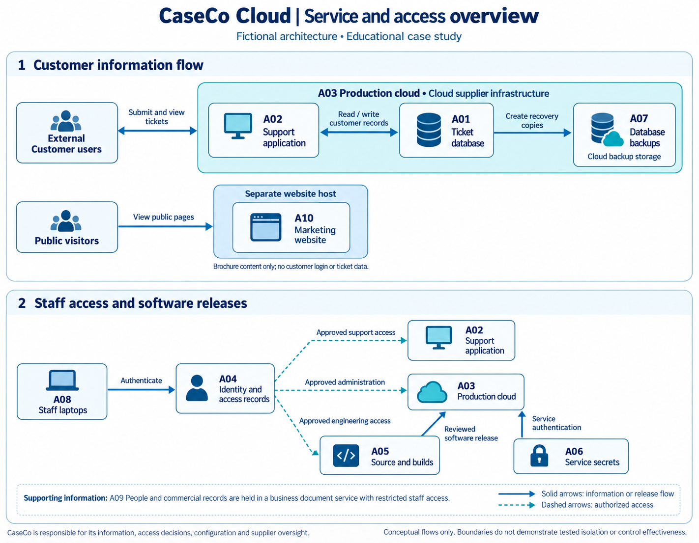

# ISO 27001 implementation planning

### A cloud software company case study

CaseCo Cloud is a **fictional 25-person B2B support-software company** preparing to answer enterprise customers' security questions. This project connects business needs to information security risks, proposed controls, and a completed access-review exercise using synthetic records.

**10 assets · 12 risks · 21 selected controls · 27 access assignments reviewed · 3 sample corrections**

The work demonstrates implementation planning and evidence evaluation. It is an educational simulation, not a certified ISMS, a real client engagement, or evidence of sustained control effectiveness. Control descriptions are original summaries; the Statement of Applicability is an extract.

## Start here

Start with the executive report, then inspect the risk decisions and access-review evidence.

| Time | Read | What to look for |
| --- | --- | --- |
| 2 minutes | [Executive report](reports/executive-report.pdf) | Business priorities, remaining risk and management decisions |
| 5 minutes | [Business scope](docs/01-context-and-scope.md) and [risk method](docs/03-risk-methodology.md) | Why the assessment covers these services and how ratings are justified |
| 10 minutes | [Registers](registers/README.md) and [control decisions](docs/05-control-selection.md) | Owners, treatments, estimated targets and supporting evidence |
| 10 minutes | [Access review](evidence/access-review/README.md) | Original records, decisions, corrections and follow-up |

## One complete example

**Business need:** enterprise customers need their ticket information accessible only to authorized people.

**Asset:** A04, identity and entitlement records, controls access to A01, customer ticket data.

**Risk:** R01 describes a departed employee retaining access. Its baseline rating is 4 * 4 = 16, High, based on a missed leaver record and the impact of ticket exposure.

**Treatment:** T01 proposes leaver reconciliation, recorded revocation, and repeat-cycle testing. The Head of Support owns it, due 2026-09-21.

**Controls:** A.5.18 and A.6.5 connect the permission lifecycle to employment changes.

**Evidence:** AR027 shows E026 enabled after departure. [CA01](evidence/access-review/corrective-actions.csv) records the correction; the [revised snapshot](evidence/access-review/access-after.csv) keeps the account record and changes enabled to No. The [follow-up](evidence/access-review/follow-up.md) verifies that change in synthetic data. The recurring process is still planned; R01's target score of 8 remains conditional.

## Explore the project

- [Governance and objectives](docs/02-governance.md)
- [Assessment and treatment decisions](docs/04-assessment-and-treatment.md)
- [90-day roadmap](docs/07-roadmap.md)
- [Management-system coverage and gaps](docs/08-coverage-and-gaps.md)
- [Data flow](diagrams/data-flow.png)
- [References and verification limits](references/README.md)
- [Release verification](docs/09-quality-review.md)

## Editable registers

The [Excel workbook](registers/isms-registers.xlsx), CSV exports and narrative counts were built from [one source dataset](registers/source-data.json). The [register guide](registers/README.md) explains inputs, formulas and refresh limits. The baseline date is 1 September 2026; the report date is 7 September 2026. All dates describe the scenario except the recorded artifact verification date.

## Why I built this

I built this case study to practise connecting business needs to risk decisions, control choices and evidence. I wanted to show how I approach GRC work: explain why a risk matters, propose a proportionate response, and distinguish a planned improvement from a verified result.

The access review brought that distinction into focus. Correcting three fictional records demonstrates the review method, but it does not establish that an offboarding process works consistently. That would require broader evidence over time.

## What I would do differently in a real engagement

- **Validate the assumptions with people and records.** Confirm the scope, information flows, obligations and recovery needs with business and technical owners before relying on the ratings or roadmap.
- **Test actual operation.** Reconcile personnel records with system access, verify that removed permissions no longer work, and examine further departures and role changes across multiple review cycles. For backups, assess observed restore results against agreed recovery needs.
- **Make decisions with accountable owners.** Check feasibility, cost and dependencies before committing to treatments. Document remaining risk and obtain the appropriate owner's decision; a proposed target score would remain an estimate until evidence supports reassessment.

## Scope and limitations

The assessment and roadmap are planning artifacts. The access review verifies changes in fictional records; it does not demonstrate sustained effectiveness in a live environment. The [coverage map](docs/08-coverage-and-gaps.md) identifies management-system work outside this case study.
