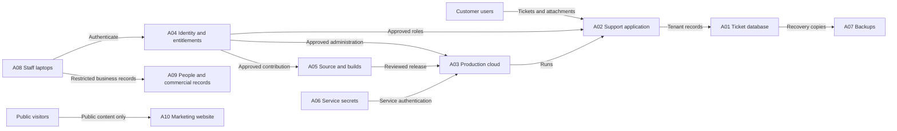

# CaseCo Cloud information flow

Fictional architecture. Arrows describe information and administrative flows; they do not assert that encryption, isolation or authentication was technically tested.

Customer devices and the public internet are external to CaseCo's organizational boundary. Cloud, source and document suppliers operate supporting services. CaseCo retains responsibility for information classification, access, configuration and supplier oversight. The public site is separate from service login and customer information.
