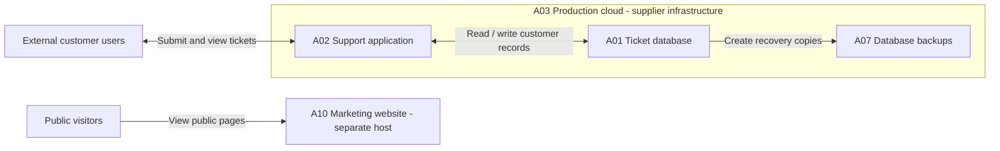
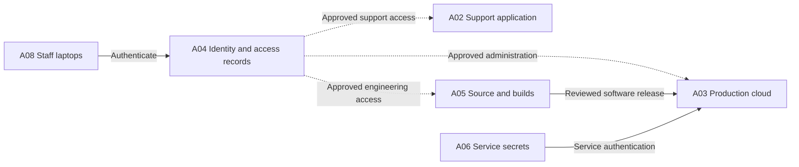

# Service and access overview

Fictional architecture. Boundaries do not demonstrate tested isolation. This drawing describes intended access relationships; the synthetic access review records exceptions separately.

## Customer information flow

The marketing website has no customer login, ticket data, payments or lead forms. Backup placement describes supplier hosting; it does not prove separation from production failures or recoverability.

## Staff access and releases

Solid arrows describe information, authentication or release flows; dashed arrows describe authorization. The identity box summarizes the identity service and entitlement records, not a gateway carrying every request. A06 also includes build signing secrets; this diagram simplifies that relationship.

A09 People and commercial records reside in a business document service with restricted staff access. CaseCo retains responsibility for its information, access decisions, configuration and supplier oversight.
